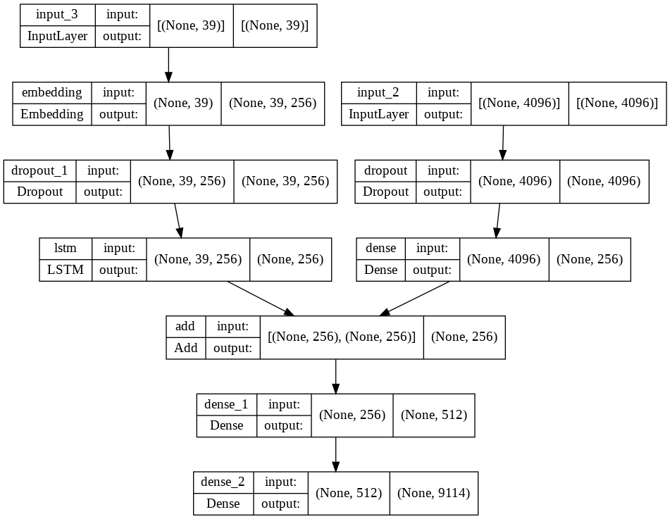

# Mini Project on Image Captioning

Image captioning system that generates natural language captions for any image.

## Dataset
The model is trained on [Flickr8k Dataset](https://www.kaggle.com/ashish2001/original-flickr8k-dataset)

## Model

    

  

## Performance
The model has been trained for 20 epoches on 7281 training samples of Flickr8k Dataset while model was evaluated on 810 testing samples.

| Sr No | BLEU SCORE |
|:-----:|:----------:|
|   1   |   0.7865   |
|   2   |   0.8110   |
|   3   |   0.7804   |
|   4   |   0.7987   |

Average Score is 0.7941

----------------------------------

## Requirements
- tensorflow
- keras
- numpy
- h5py
- progressbar2

These requirements can be easily installed by:
  `pip install -r requirements.txt`

## Results

Image | Caption 
--- | --- 
 | **Generated Caption:**  a young girl in striped shi
 | **Generated Caption:** a snowboarder rides down a snowy slope
 | **Generated Caption:** a black and white dog is running on the beach

Click [here](https://mega.nz/file/tckTiKgC#qH9Tbp5J0fvv3XkCTiYJIULDLXX-_CxZa1Y_zICu7fs) to download objects used in project.